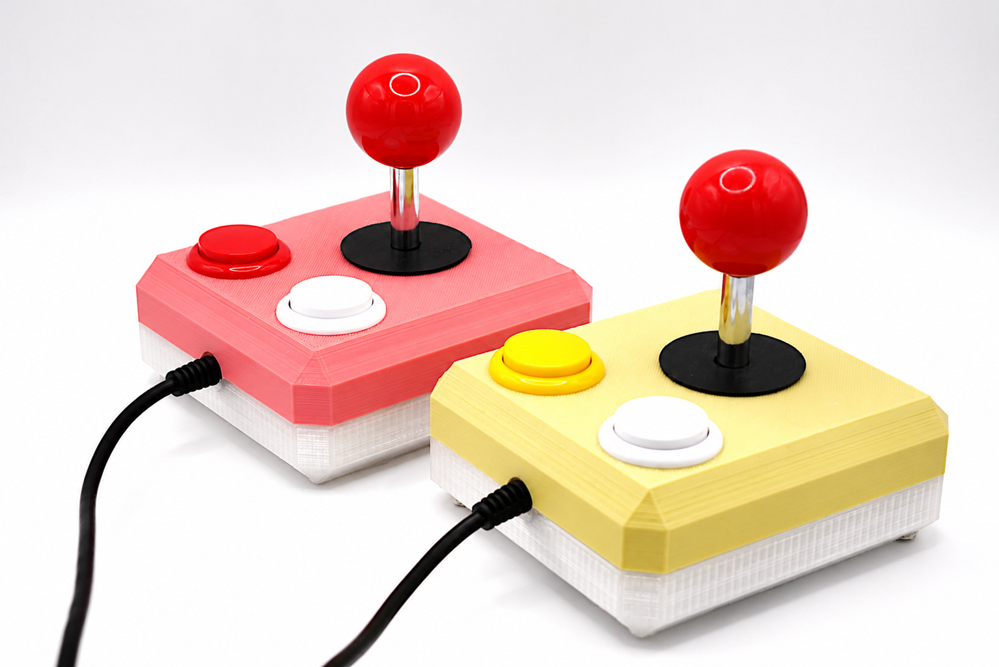
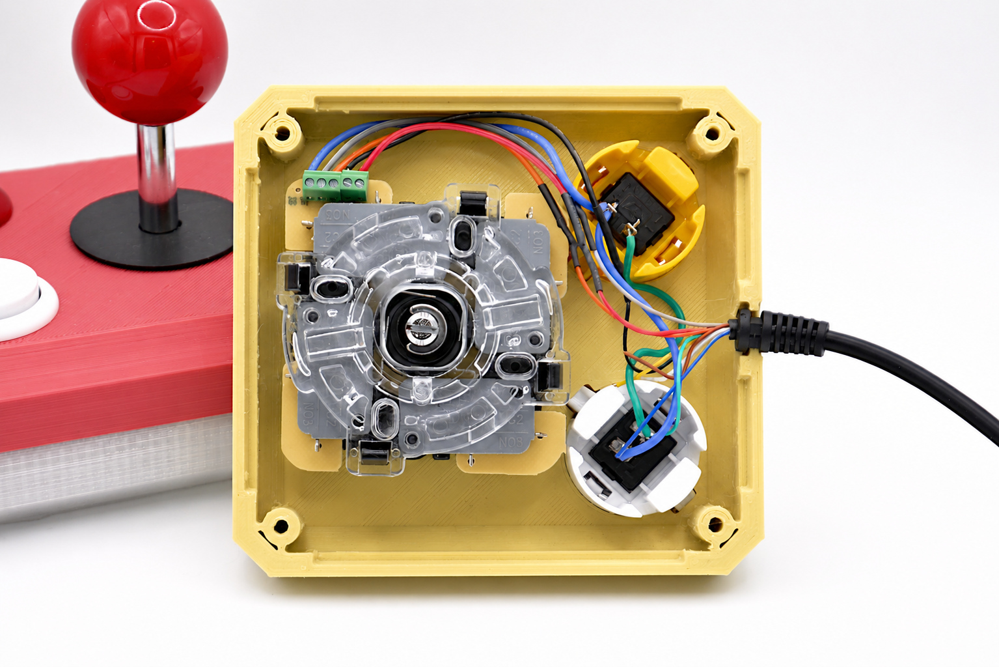
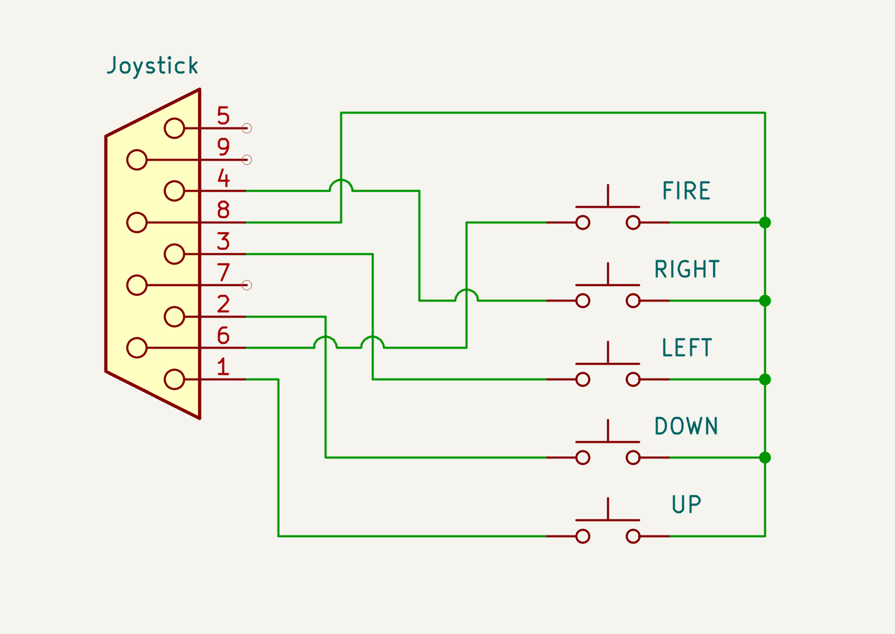
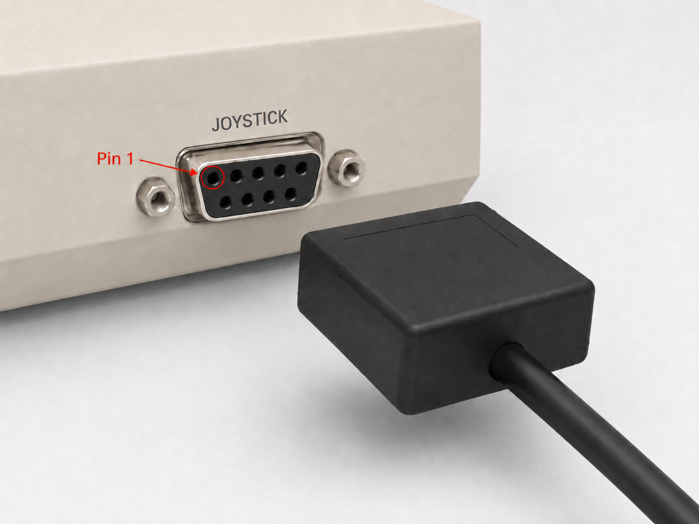

# C64 Joysticks

In order to enjoy my brand new C64 Ultimate I decided to build a pair of two mechanical joysticks.

I decided to print the cases myself and equip the joysticks with readily available joystick modules, arcade buttons and cables. See the links down below. The joystick modules come with a metal plate which has to be removed in order to fit in the case. However, despite these products came in quite good quality they are no-name components which may change in quality, color and function. So please take care and double-check how to connect everyting.

This is the pinout of the C64´s joystick port. However, I had to swap up/down at the joystick module in order to make them work as expected. Everything is a matter of perspective you know.

I also struggle with mirroring considerations of those connector schematics -- is it the jack or plug? Seen from which side? So once and for all, this is the unambiguous depiction of where Pin 1 is. You're welcome.

## Links

Case: https://www.thingiverse.com/thing:2890310

Arcade Buttons: https://link.amazon/B08AE0hTG

Cables: https://link.amazon/B098J3Oxh

Joystick: https://link.amazon/B07DofJZy
